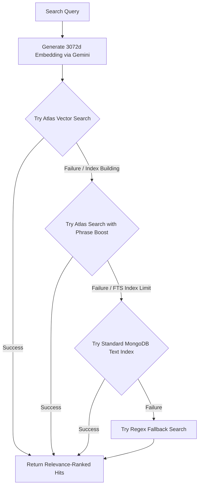

# Technical Architecture

This document describes the technical stack, system components, database schemas, and integration points for the **Operio Autonomous Mall Operations Agent**.

---

## 1. Technology Stack

- **LLM & Reasoning Engine:** Gemini 2.5 Flash (integrated via the official `google-genai` Python SDK).
- **Backend Orchestrator:** FastAPI & Python 3.13 (coordinating the agent reasoning loop and exposing endpoints to the frontend).
- **External Integration Layer (MCP Servers):**
  - **MongoDB MCP Server:** Spawned as a Node.js stdio subprocess, managing database collections (Tenants, Staff, Work Orders, Sessions, Leases, Manuals) and executing both CRUD operations and RAG search.
- **Observability & Tracing:** **Arize / Phoenix** (using `openinference-instrumentation-google-genai` and OpenTelemetry to capture trace trees, latencies, and tool execution metrics).
- **Frontend Interface:** Glassmorphic single-page application built with React 19, TypeScript, Vite, and a functional Zustand state layer.

---

## 2. System Architecture Overview

The system consists of three main boundaries: the User Interface, the Python Orchestrator, and the External Integration Layer (exposed via Node.js MCP servers running as stdio subprocesses managed by Python).

```txt
+-------------------------------------------------------------+
|                       DEMO PORTAL (UI)                      |
|   Tenant Chat Portal   |    Operations Command Dashboard    |
+------------------------------+------------------------------+
                               |
                               v REST API (FastAPI)
+-------------------------------------------------------------+
|                     PYTHON AGENT CORE                       |
|   - FastAPI Server (main.py) with Thread Session Context    |
|   - Gemini Orchestrator (brain.py) using google-genai SDK   |
|   - Async Process Supervisor (mcp_client.py)                |
+------------------------------+------------------------------+
                               |
                               v Model Context Protocol (Stdio)
+-------------------------------------------------------------+
|                 EXTERNAL INTEGRATION LAYER                  |
|    - MongoDB MCP Server (CRUD & RAG Search)                 |
+---------------+------------------------------+--------------+
                |                              |
                v OTel Tracing                 v Tracing Logs
+----------------------------------------------+--------------+
|                        OBSERVABILITY                        |
|   Arize Phoenix Collector (http://localhost:6006)           |
+-------------------------------------------------------------+
```

---

## 3. Data Schemas (MongoDB)

To facilitate operational dispatching, the agent interacts with three key database collections.

### A. Tenants (`tenants`)

Represents mall tenants and links to their lease agreement records.

```json
{
  "_id": "tenant_001",
  "storeName": "Nike Store",
  "unitNumber": "Unit 104",
  "sector": "Sector B",
  "managerName": "Marcus Vance",
  "contactEmail": "marcus.vance@nike-mall.com",
  "leaseId": "lease_nike_104"
}
```

### B. Technicians / Staff (`staff`)

Tracks active on-site maintenance engineers, their locations, and skills.

```json
{
  "_id": "staff_001",
  "name": "Sarah Connor",
  "skills": ["HVAC", "Electrical"],
  "status": "Available",
  "currentLocation": "Sector B",
  "shiftStart": "08:00",
  "shiftEnd": "17:00",
  "ratePerHour": 45.0
}
```

### C. Work Orders (`work_orders`)

Contains current maintenance records, timelines, and Yardi/ServiceChannel integration payloads.

```json
{
  "_id": "wo_9942",
  "tenantId": "tenant_001",
  "assetId": "asset_hvac_104",
  "description": "Storefront AC unit blowing warm air.",
  "status": "Dispatched",
  "assignedTo": "staff_001",
  "costEstimation": 850.0,
  "leaseResponsibility": "Tenant",
  "leaseClauseRef": "Section 9.1 - Tenant AHU Maintenance",
  "emergencyLevel": "Routine",
  "externalSystemPayload": {
    "source": "Operio-Agent",
    "externalId": "WO-742910",
    "action": "CREATE_AND_DISPATCH",
    "costCenter": "Tenant-Reimbursable"
  },
  "timeline": [
    { "status": "Created", "timestamp": "2026-06-05T15:50:00Z" },
    { "status": "Dispatched", "timestamp": "2026-06-05T15:50:02Z" }
  ]
}
```

---

## 4. MCP Integration Strategy

### A. MongoDB MCP Server (CRUD & RAG Search)

Exposes transactional, state management, and information retrieval capabilities.

- **Tenant Isolation**: To prevent cross-tenant lease leaks, the `search_leases` tool requires `leaseId`. The Python backend resolves the caller's lease ID from session credentials and injects it into the MongoDB query.
- **Dynamic Routing**: The server evaluates ticket emergency levels and liabilities to route statuses:
  - If `emergencyLevel` is `Emergency`, the status shifts to `Dispatched` (Emergency Bypass).
  - Else if `leaseResponsibility` is `Tenant`, the status is `Dispatched` (Tenant Chargeback).
  - Else if `leaseResponsibility` is `Landlord` and `costEstimation` > $150, the status is `Pending Approval` (HITL Escalation).
- **Tools**:
  - `search_leases(leaseId, query)`: Performs semantic keyword search restricted to a single lease context.
  - `search_manuals(equipment_model, query)`: Finds diagnostic and troubleshooting steps for specific assets.
  - `query_active_staff(skill, sector)`: Finds available on-site operators.
  - `create_work_order(wo_payload)`: Inserts a new work order.
  - `update_work_order_status(wo_id, status, technician_id)`: Updates database state.

---

## 5. Decision Routing & Human-in-the-Loop (HITL)

The agent orchestrator routes requests through a set of strict operational guardrails:

```txt
       [Tenant Request Received]
                   |
                   v
         [Lease RAG Query]
                   |
                   v
      [Resolve Liability & Cost]
                   |
         +---------+---------+
         |                   |
         v                   v
   [Emergency?]       [Tenant Liable?]
     /       \            /      \
  YES         NO       YES        NO
  /             \      /            \
 [Bypass]   [CAM Repair] [Chargeback] [CAM Repair]
 [Dispatch]      |       [Dispatch]        |
                 |                         v
                 |                 [Cost > $150?]
                 |                    /     \
                 |                 YES       NO
                 |                 /           \
                 +------------> [HITL Gate]   [Dispatch]
```

1. **Emergency Bypass**: Triggered by extreme weather context (e.g. extreme winter cold alerts below -15°C or burst pipes). The agent sets `emergencyLevel: 'Emergency'`, forcing an immediate auto-dispatch.
2. **Tenant Chargeback**: When RAG audit confirms that the tenant is liable for the repair under lease clauses (e.g. Nike HVAC repairs under $1,000), the ticket is auto-dispatched since the landlord incurs no cost.
3. **HITL Gate**: When the landlord is liable (Common Area Maintenance) and the repair costs exceed $150, the agent flags the ticket as `Pending Approval`. The manager can override details (cost, technician, notes) and review the generated ServiceChannel/Yardi payload before authorizing dispatch.

---

## 6. Multi-Tiered RAG Search Pipeline

To bridge the gap between simple keyword lookup and semantic understanding (e.g., matching "Air Conditioning" to "HVAC" or "Air Handling Unit (AHU)" instead of just any document containing the word "air"), the Evidence Explorer operates a self-healing, multi-tiered search pipeline.

This pipeline runs identically in the backend Python RAG endpoint and the TypeScript MCP server:

### A. Fallback Sequence


1. **Tier 1: Atlas Vector Search (`$vectorSearch`):** Computes 3072-dimensional vector embeddings for search queries at runtime using the Gemini embedding API (`gemini-embedding-2`). Documents are stored with pre-calculated embeddings. Enforces tenant pre-filtering (e.g., restricted to caller's `leaseId`).
2. **Tier 2: Atlas Search (`$search`) with Phrase Boosting:** Runs a compound Lucene query:
   - A `should` clause matching spelling variations (fuzzy).
   - A `phrase` clause with a slop of 2 to boost exact phrases (e.g., "Air Conditioning" gets a high relevance score while isolated matches on "air" score low).
3. **Tier 3: Standard MongoDB Text Search (`$text`):** Leverages native MongoDB text indexes (`title_text_content_text`). This serves as the primary fallback if the Atlas FTS index limit has been exceeded on shared/free cluster tiers.
4. **Tier 4: Regex Fallback:** A case-insensitive regex pattern match mapping multiple query terms as a final fail-safe.

